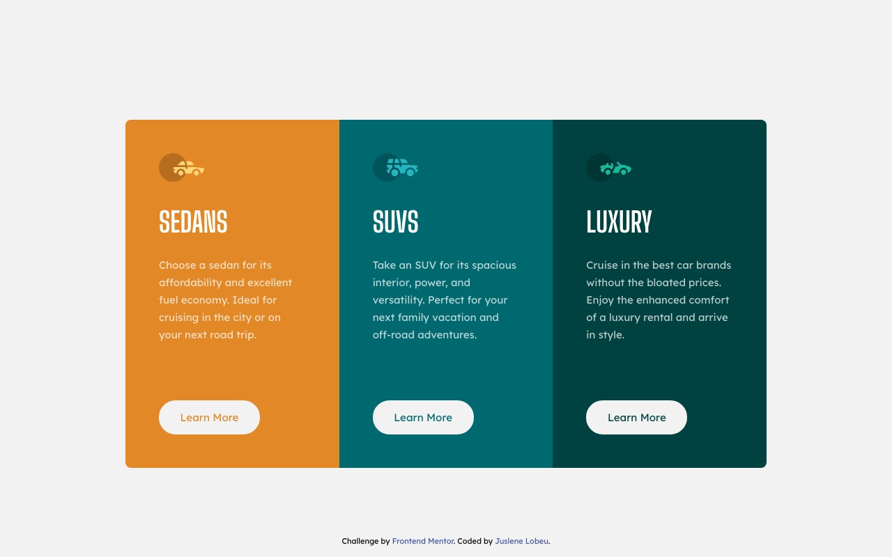

# Frontend Mentor - 3-column preview card component

Segunda solução criada para o desafio proposto pelo **Frontend Mentor** - [3-column preview card component](https://www.frontendmentor.io/challenges/3column-preview-card-component-pH92eAR2-)

## Table of contents

- [Overview](#overview)
  - [O Desafio](#o-desafio)
  - [Screenshot](#screenshot)
  - [Links](#links)
- [Meu processo](#meu-processo)
  - [Construção](#construção)
  - [O que aprendi](#o-que-aprendi)
  - [Desenvolvimento contínuo](#desenvolvimento-contínuo)
- [Autora](#autora)

## Overview

### O Desafio

Os usuários devem ser capazes de:

- Ver o layout ideal, dependendo da tela do dispositivo

### Screenshot

#### Desktop


#### Tablet


#### Mobile


### Links

- Site: [Preview](https://juslenelobeu.github.io/3-column-preview-card-component/)

## Meu processo

### Construção

- HTML
- CSS Grid

### O que aprendi

Para realisar o desafio com o visual mais fiel ao design proposto, pesquisei formas de suavisar os textos e descobri a propriedade de CSS ```-webkit-font-smoothing: antialiased;```.

### Desenvolvimento contínuo

Pretendo me aprofundar mais no estudo das propriedades do **CSS3**

## Autora

- Frontend Mentor - [@juslenelobeu](https://www.frontendmentor.io/profile/juslenelobeu)
- Linkedn - [Linkedin](https://www.linkedin.com/in/juslenelobeu/)
